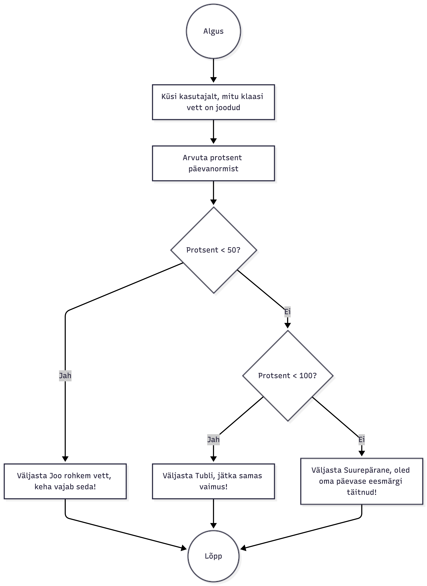

# Veetarbimise jälgimise programm

See programm aitab jälgida, kui palju vett oled päeva jooksul joonud ning annab tagasisidet, kas oled oma päevase vee eesmärgi täitnud.

## Ülesande kirjeldus

Arstid soovitavad juua päevas **2 liitrit vett**. Programm küsib kasutajalt, mitu klaasi vett ta on juba joonud (1 klaas = 250 ml), arvutab, mitu protsenti päevanormist on täidetud, ja annab tagasisidet:

- Kui protsent < 50: `Joo rohkem vett, keha vajab seda!`
- Kui protsent < 100: `Tubli, jätka samas vaimus!`
- Kui protsent ≥ 100: `Suurepärane, oled oma päevase eesmärgi täitnud!`

## Koodi näide

```python
DAILY_WATER_ML = 2000
GLASS_VOLUME_ML = 250

# Päevase klaaside arvu arvutamine
daily_glasses = DAILY_WATER_ML / GLASS_VOLUME_ML

# Kasutaja sisendi küsimine
glasses_drunk = int(input('Mitu klaasi vett oled täna joonud? (1 klaas = 250 ml) '))

# Protsendi arvutamine
percentage = (glasses_drunk / daily_glasses) * 100

# Tagasiside kuvamine
if percentage < 50:
    print('Joo rohkem vett, keha vajab seda!')
elif percentage < 100:
    print('Tubli, jätka samas vaimus!')
else:
    print('Suurepärane, oled oma päevase eesmärgi täitnud!')
```

## Programmavoo skeem




## Kuidas kasutada

1. Ava Python interpreteerija või IDE.
2. Kopeeri ja käivita ülaltoodud kood.
3. Sisesta, mitu klaasi vett oled juba joonud.
4. Vaata tagasisidet.